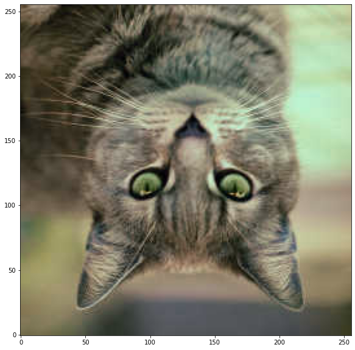
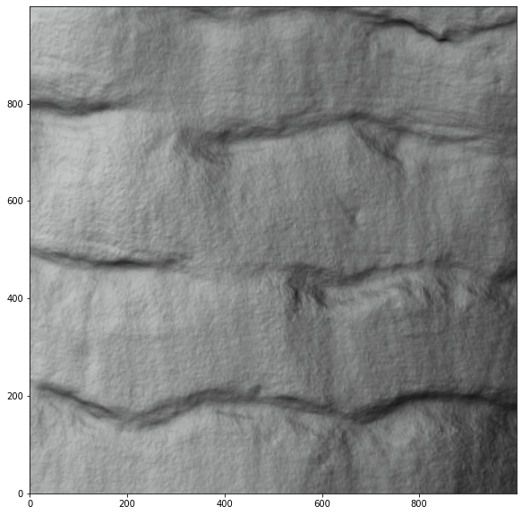
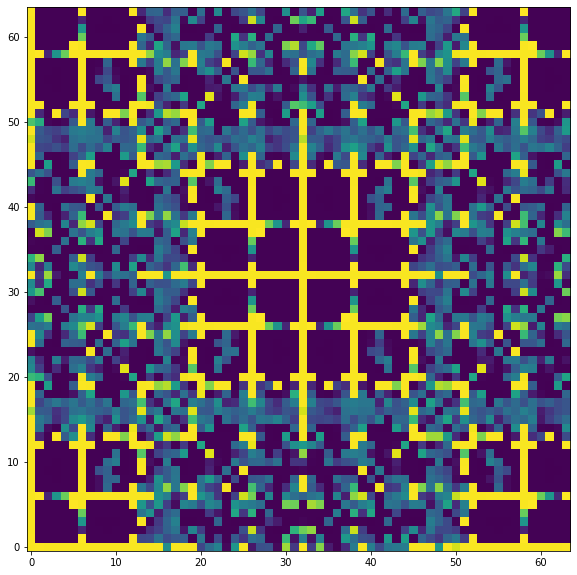
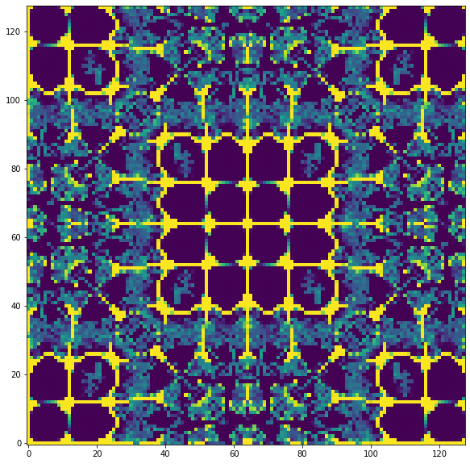
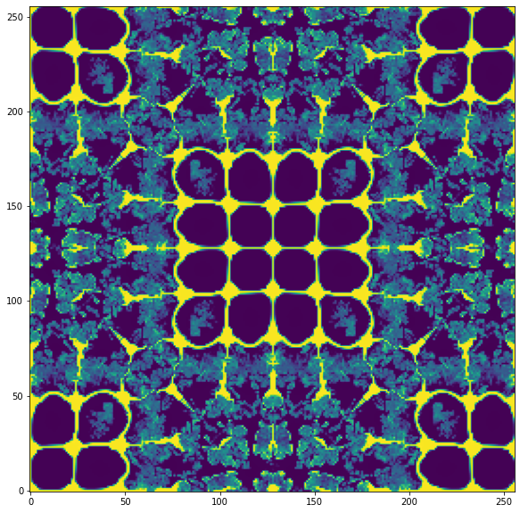
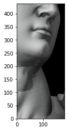

# Table of contents
{: .no_toc .text-delta }

1. TOC
{:toc}

---

# Quick tour of OpenVisus in python


### Define some utility functions:


```python
import os,sys

# Here are commands to install a package (OpenVisus) directly from a jupyter notebook
# after you install those once you can comment those comment
# !{sys.executable} -m pip install numpy matplotlib OpenVisus
```


```python
from PIL import Image
from urllib.request import urlopen
import matplotlib.pyplot as plt
import shutil

def LoadImage(filename):
	if filename.startswith('http'):
		filename=urlopen(filename) 
	return numpy.asarray(Image.open(filename))

def ShowImage(data,width=10):
	ratio=float(data.shape[1])/data.shape[0]
	fig = plt.figure(figsize = (width,width*ratio))
	ax = fig.add_subplot(1,1,1)
	ax.imshow(data, origin='lower')
	plt.show()
```

### First import OpenVisus


```python
from OpenVisus import *
```

    Starting OpenVisus c:\python38\lib\site-packages\OpenVisus\__init__.py 3.8.6 (tags/v3.8.6:db45529, Sep 23 2020, 15:52:53) [MSC v.1927 64 bit (AMD64)] sys.version_info(major=3, minor=8, micro=6, releaselevel='final', serial=0) ...


### Create an empty RGB dataset


```python
idx_filename='tmp/quick_tour/visus.idx'
shutil.rmtree(os.path.dirname(idx_filename), ignore_errors=True)
CreateIdx(url=idx_filename, dim=3, dims=[1025,512,256],fields=[Field('data','uint8[3]','row_major')])
```


    <OpenVisus.dataset.PyDataset at 0x2632f45b130>


### Create a 2d dataset from numpy array


```python
data=LoadImage('https://raw.githubusercontent.com/sci-visus/OpenVisus/master/datasets/cat/gray.png')
shutil.rmtree(os.path.dirname(idx_filename), ignore_errors=True)
CreateIdx(url=idx_filename, dim=2, data=data)
```


    <OpenVisus.dataset.PyDataset at 0x2634fa76190>


### Create a 3d dataset from numpy array


```python
data=numpy.zeros((100,100,100,3),dtype=numpy.float32) 
shutil.rmtree(os.path.dirname(idx_filename), ignore_errors=True)
CreateIdx(url=idx_filename, dim=3, data=data)
```


    <OpenVisus.dataset.PyDataset at 0x2634fa769a0>


### Create a 3d datasets from 2d slices


```python
data=LoadImage('https://raw.githubusercontent.com/sci-visus/OpenVisus/master/datasets/cat/rgb.png')
height,width=data.shape[0],data.shape[1]

# replicate one 2d images 10 times
depth=10

def generateSlices():
    for I in range(depth): 
        yield data

shutil.rmtree(os.path.dirname(idx_filename), ignore_errors=True)    
db=CreateIdx(url=idx_filename, dims=[width,height,depth],fields=[Field('data','uint8[3]','row_major')])
db.writeSlabs(generateSlices())
```

### Read a single slice


```python
data=db.read(z=[0,1])[0,:,:]
ShowImage(data)
```


    

    


### Read stuff in one shot at full resolution


```python
db=LoadDataset('http://atlantis.sci.utah.edu/mod_visus?dataset=david_subsampled')
data=db.read(x=[10000,11000],y=[10000,11000])
ShowImage(data)
```


    

    


### Show image coarse to fine


```python
db=LoadDataset('http://atlantis.sci.utah.edu/mod_visus?dataset=2kbit1')
for data in db.read(x=[0,2048],y=[0,2048],z=[1024,1025], num_refinements=3, quality=-9):
    ShowImage(data[0,:,:])
```


    

    


    

    


    

    


### Get data in normalized coordinates


```python
db=LoadDataset('http://atlantis.sci.utah.edu/mod_visus?dataset=david_subsampled')
data=db.read(x=[0.35,0.45],y=[0.8,0.9],quality=-8)
print(data.shape,data.dtype)
ShowImage(data)
```

    (440, 183, 3) uint8


    

    


### Start a local visus server for one dataset


```python
shutil.rmtree(os.path.dirname(idx_filename), ignore_errors=True) 
CreateIdx(
    url=idx_filename, 
    dim=2,
    blockperfile=-1,
    filename_template="./visus.bin", 
    data=LoadImage('https://raw.githubusercontent.com/sci-visus/OpenVisus/master/datasets/cat/rgb.png'))

modvisus = ModVisus()

port=10000
modvisus.configureDatasets(ConfigFile.fromString('''
<visus>
  <datasets>
    <dataset name='default' url='tmp/quick_tour/visus.idx' permissions='public' />
  </datasets>
</visus>
'''))
server=NetServer(port, modvisus)

server.runInBackground()

body=urlopen('http://127.0.0.1:{}/mod_visus?action=read_dataset&dataset=default'.format(port)).read().decode('utf8')
print(body)

server.signalExit()
server.waitForExit()
print('server done')
```

    (version)
    6
    (box)
    0 255 0 255
    (fields)
    DATA uint8[3] default_compression(zip) default_layout(row_major) default_value(0) min(0 0 0) max(0 0 0) 
    (bits)
    V0101010101010101
    (bitsperblock)
    16
    (blocksperfile)
    1
    (interleave block)
    0
    (filename_template)
    ./visus.bin
    (missing_blocks)
    0
    
    server done


```python

```
