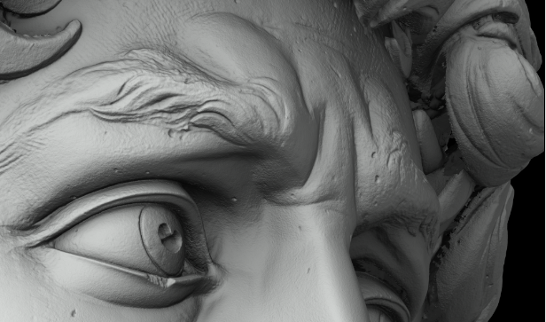
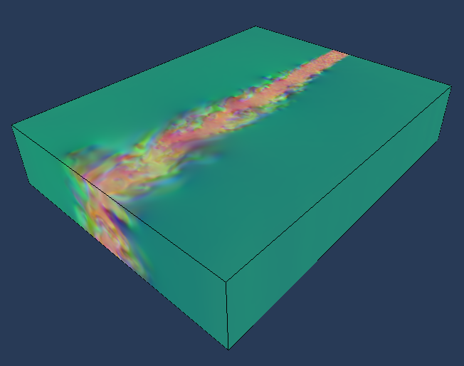

# Viewer Features
{: .no_toc }

# Table of contents
{: .no_toc .text-delta }

1. TOC
{:toc}

## Basic Usage

The default layout of the viewer looks like the following picture:


In the window you have:

*   a toolbar that contains the most basic options
*   a left sidebar that shows the tree of datasets and visualization/computing nodes used in your workflow. Each element in this sidebar is called **node**
*   the canvas, where you can navigate and interact with the data

More windows can pop up to customize each node.

### Open/Add a dataset

A dataset can be either local or remote (e.g. provided by a [ViSUS Server](({{ site.baseurl }}))).

#### Local dataset

Two options are available to open a local dataset in the menu _File_:

*   Open file... (open a single file, all the datasets in the current session will be discarded)
*   Add file... (add a dataset to the current session)

#### Remote dataset

Two options are available to open a remote dataset in the menu _File_:

*   Open URL... (open a remote dataset, all the datasets in the current session will be discarded)
*   Add URL... (add a dataset to the current session)

Try, for example, to open the Gigapixel 2D dataset David using this URL: [http://atlantis.sci.utah.edu/mod\_visus?dataset=david](http://atlantis.sci.utah.edu/mod_visus?dataset=david)

And zoom in as you like!

### Bookmarks and Configuration

A fresh ViSUS installation should provide in the _Bookmarks_ menu a list of datasets that are publicly available. You can use those to experience some of the functionalities and performance of ViSUS Viewer or add your own IDX datasets using the [ViSUS configuration file]({{ site.baseurl }}).

Advanced configuration (i.e. mostly performance and platform specific related) are also contained in the [ViSUS configuration file]({{ site.baseurl }}).

### Save/Open a scene

The current scene can be saved on disk using the _File->Save scene..._ command. The scene will contain all the datasets and settings in the current session.

The current scene can also be saved as _history_ that will contain also all the operation performed by the user in the scene (i.e. using _File->Save history..._).

The same scene can be later opened from _File->Open file..._ and shared with other users (i.e. assuming other users can access the datasets in the scene using the same path/URL, this means that datasets might be remote or on a shared file system).

### Nodes/Filters

When you open or add a new datasets you will get a tree of nodes on your left sidebar that will allow to define analysis and visualization pipelines.

The default Nodes are the **dataset node** that provides information about the dataset and the **time node** that allows to move along the timesteps contained in the datasets.

The main types of _Node_ that the user can add are:

*   [Slice Node](#slice-node), creates a slice selection of the dataset and related rendering pipeline
*   [Volume Node](#volume-node), creates a volume rendering pipeline
*   [IsoContour Node](#isocontour-node), creates an isocountour rendering node allowing the possibility to change isovalue interactively
*   [Scripting Node](/index.php/Scripting_Node "Scripting Node"), allows the user to define execute interactively an analysis code on the input data or use one of the predefined scripts

You can add a _Node_ using the menu _Add_.

#### Slice Node

The slice node renders a 2D slice.

For example if we open with ViSUS Viewer a 3D dataset like: [http://atlantis.sci.utah.edu/mod\_visus?dataset=rabbit3d](http://atlantis.sci.utah.edu/mod_visus?dataset=rabbit3d)

We will get the following slice rendering:


#### Volume Node

A volume node performs a volume rendering of the input data.

For example if we open with ViSUS Viewer the URL: [http://atlantis.sci.utah.edu/mod\_visus?dataset=borg](http://atlantis.sci.utah.edu/mod_visus?dataset=borg)

We can visualize the following volume rendering (timestep 15 using a "Ice" palette):


#### IsoContour Node

An iso contour node computes an iso surface at a certain input iso value.

For example if we open with ViSUS Viewer the URL: [http://atlantis.sci.utah.edu/mod\_visus?dataset=borg](http://atlantis.sci.utah.edu/mod_visus?dataset=borg)

We can visualize the following iso surface (isovalue ~65.68):


#### Scripting Node

The scripting node allows to perform operations on the data using **python**.

This node can be added to any other node, for example a [Volume Node](/index.php/Volume_Node "Volume Node") (i.e. to produce a volume rendering of the data) or a [Slice Node](/index.php/Slice_Node "Slice Node").

##### Example using 2D images

Using the Gigapixel David dataset at the URL: [http://atlantis.sci.utah.edu/mod\_visus?dataset=david](http://atlantis.sci.utah.edu/mod_visus?dataset=david)

we can apply scripting using some of the predefined filters/scripts.

For example from the original image:



Using a "2D/Emboss" filter script you will get something like the following:


##### Examples using a vector field

In the following examples we will use a vector field from a large scale combustion dataset. You can open this dataset with your ViSUS Viewer using "Open URL" and this address: [http://atlantis.sci.utah.edu/mod\_visus?dataset=lifted\_time](http://atlantis.sci.utah.edu/mod_visus?dataset=lifted_time)

A Volume Node for a vector field will visualize a volume rendering as following (using a "Gamma" palette):



Since the data has 3 components the default visualization uses the 3 components as RGB channels.

If we want to evaluate and visualize the squared magnitude of this (three-dimensional) vector field the user can simply insert a scripting node with the following script:

```
output=
 ((1.0\*input\[0\])\*input\[0\]) + 
 ((1.0\*input\[1\])\*input\[1\]) + 
 ((1.0\*input\[2\])\*input\[2\]);
```

Where the `input` field represent the input data that enter the scripting node, the output represents the result of the computation.

The output will be a scalar field that will be rendered as following:


Another example using a vector field is to compute a 2D **Linear Integral Convolution** (LIC), this can be done using the following simple script:

```
output=Visus.Array.lic(input,0,1);
```

where the second and third parameters of the _lic_ function are the vector's components that we want to use for the computation.

The result will be like the following (using a "Banded" palette) adding this script to a [Slice Node](#slice-node):


## Use Collections of IDX datasets

Sometimes can be useful to define a collection of IDX dataset to use for interactive visualization or analysis. MIDX is file format that can define a collection of IDX files.

The simplest example of MIDX is the following:

```xml
<dataset typename\='IdxMultipleDataset'\>
  <dataset url\='file://$(CurrentFileDirectory)/my\_dataset.idx' name\= 'pressure'  />
  <dataset url\='file://$(CurrentFileDirectory)/my\_other\_dataset.idx' name\= 'temperature'  />
</dataset>
```

This MIDX simply defines two datasets that could be either locally or remote.

When you load an .midx file in ViSUS Viewer you will have a new element in you Nodes which is the "Field Node". In an MIDX since you have several input datasets the field node is responsible to select the input of your Node (e.g. a volume rendering node). So you can either choose one of the inputs:

```
A=input\[0\];
output=A;
```

or even combine them to produce a derived data input as in the following example (interleaved):

```
A=input\[0\];
B=input\[1\]; 
output=Visus.Array.interleave(\[B,B,B,A\]);
```

In this example we created an array that is made of 4 components. We can map those four component to the RGBA channels of our palette enabling "Enable palette" on the Render Node. This allows to control the visualization of B using the data in A simply varying the alpha channel in the Palette Node.

Here are some other examples:

*   [MIDX examples](/index.php/MIDX_examples "MIDX examples")

Retrieved from "[http://wiki.visus.org/index.php?title=ViSUS\_Viewer](http://wiki.visus.org/index.php?title=ViSUS_Viewer)"