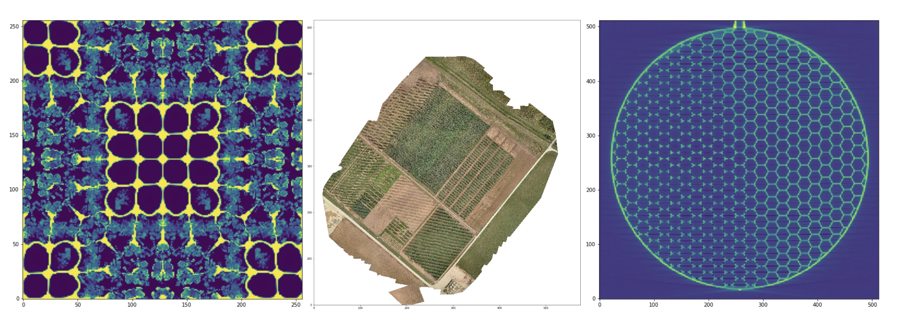

# OpenViSUS Documentation
{: .no_toc }
The mission of ViSUS.org is to provide support for the scientific community with Big Data, management, analysis and visualization tools. In this website we provide access to open source software tools and libraries such as the ViSUS framework and the PIDX library. These softwares are distributed under the permissive BSD license (see LICENSE file).

The goal of this website is to allow users of OpenViSUS to have a searchable platform for learning and troubleshooting the OpenViSUS Python package. The OpenViSUS Python package allows users to connect to a self-hostable [OpenViSUS Server]({{ site.baseurl }}).

## Getting Started
{: .no_toc }

## Table of contents
{: .no_toc .text-delta }

1. TOC
{:toc}

---

### Installation
OpenViSUS is available through [pip](https://pypi.org/project/OpenVisus/) and [conda](https://anaconda.org/ViSUS/openvisus).

Through `pip`:

```bash
$ python -m pip install OpenVisus
```

Through `conda`:
```bash
$ conda install -c visus openvisus
```

Once installed through your Python package manager of choice, run the configuration:
```bash
$ python -m OpenVisus configure
```

### Using OpenViSUS with Python and Jupyter
See the different functions available for use in Python [here]({{ site.baseurl }}).

### Using the OpenViSUS Viewer
Launch the OpenViSUS viewer using the following command:
```bash
$ python -m OpenVisus viewer
```

See the different features of the viewer [here]({{ site.baseurl }}).

### Hosting a ViSUS Server
The ViSUS server can be self-hosted through [various methods]({{ site.baseurl }}).

### Connecting to an Existing ViSUS Server
You can create a `visus.config` file which specifies server information for faster data access when using the Python package or viewer. [Learn more]({{ site.baseurl }}) about creating a `visus.config`.

### Contributing to Documentation
This documentation lives on the [`gh-pages`](https://github.com/sci-visus/OpenVisus/tree/gh-pages) branch of the [OpenViSUS Repository](https://github.com/sci-visus/OpenVisus). Please make a GitHub PR to contribute to this documentation. Because this branch is independent of `main`, use `git switch gh-pages` to view and edit documentation locally.

### Older Documentation
Older documentation can be found on [this page]({{ site.baseurl }}).